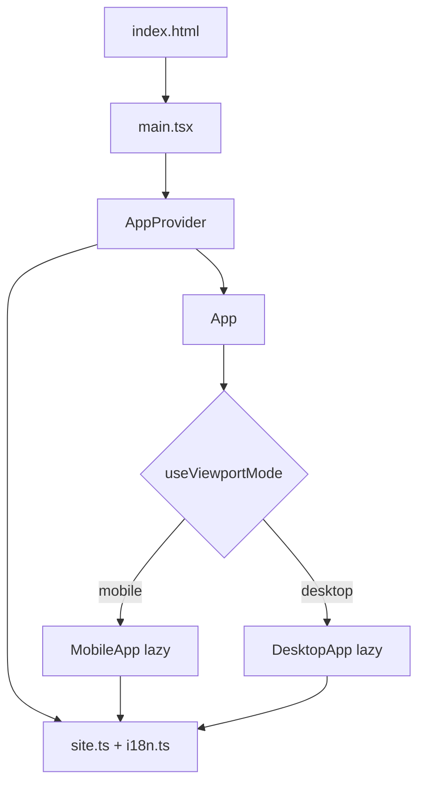

# Architecture

## Purpose

JabPoint Tallinn is a **static, content-driven marketing site**. There is no backend. All visitor-facing copy and contact details live in TypeScript data modules so non-framework edits stay localized and type-checked.

## Design principles

1. **Data first** — brand, contacts, and copy are not buried in JSX.
2. **Two UI shells** — desktop and mobile are separate component trees and stylesheets, not one layout stretched with media queries.
3. **Shared brain** — language, theme, and site config are shared through React context.
4. **Stable mode switching** — viewport mode uses hysteresis + debounce so resizing near the breakpoint does not flicker between shells.
5. **Lazy shells** — only the active shell’s JS/CSS chunk loads after the mode decision.

## Runtime flow

1. `main.tsx` mounts `AppProvider` (lang/theme) and `App`.
2. `App` reads `useViewportMode()` and Suspense-loads either `MobileApp` or `DesktopApp`.
3. Both shells consume `useApp()` for dictionary text and theme class names.
4. Images resolve from `public/img/` via paths in `site.images`.

## Layering

| Layer | Location | Responsibility |
|-------|----------|----------------|
| Entry | `index.html`, `src/main.tsx` | HTML shell, fonts, React root |
| App switch | `src/App.tsx` | Choose desktop vs mobile shell |
| Shared state | `src/components/AppProvider.tsx`, `src/hooks/useApp.ts` | Language, theme, dictionary |
| Domain data | `src/data/*` | Editable site config + i18n |
| Viewport policy | `src/viewport/mode.ts`, `src/hooks/useIsMobile.ts` | Pure mode resolution + React hook |
| Desktop UI | `src/desktop/*` | Marketing page layout |
| Mobile UI | `src/mobile/*` | Native-feel shell (tabs, sheet, FAB) |
| Shared styles | `src/styles/tokens.css` | CSS variables, reset, animations |
| Tests | `src/**/*.test.ts(x)`, `src/test/*` | Mode logic and shell switching |

## What is intentionally not shared

Desktop and mobile **do not** share section components. Parallel files (e.g. `Hero` vs `MobileHero`) exist so mobile UX can diverge (carousel, bottom tabs, call FAB) without fighting desktop markup.

Shared pieces are limited to:

- `site` / `dict` data
- `AppProvider` / `useApp`
- viewport mode helpers
- CSS custom properties in `tokens.css`

## Persistence

| Key | Storage | Values |
|-----|---------|--------|
| `jabpoint_lang` | `localStorage` | `et` \| `en` \| `ru` |
| `jabpoint_theme` | `localStorage` | `dark` \| `light` |

Theme defaults from `prefers-color-scheme` when unset. Language defaults to `site.defaultLang` (`et`).

## Prototype origin

The visual system started from an HTML design-canvas prototype kept under `prototype/`. The React app reimplements that look as maintainable components; the prototype is reference-only and is not part of the build.
